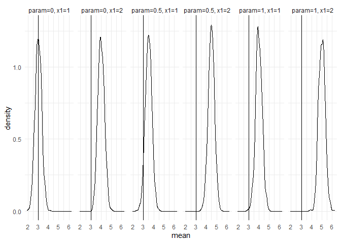
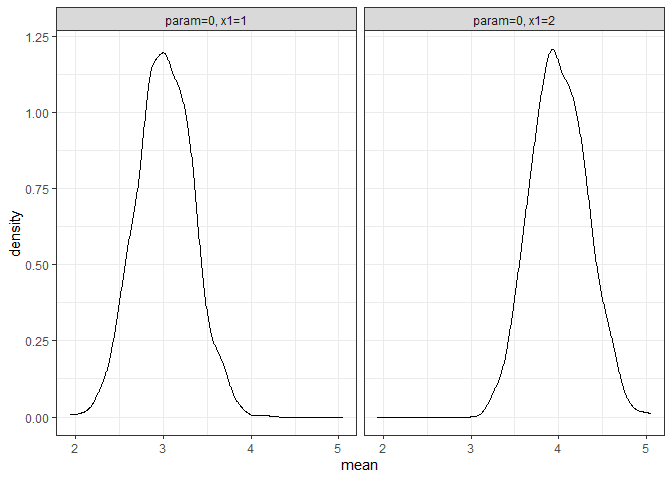
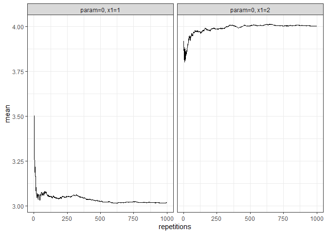

# tidyMC

<!-- badges: start -->
<!-- badges: end -->

Monte Carlo Simulations aim to study the properties of statistical
inference techniques. At its core, a Monte Carlo Simulation works
through the application of the techniques to repeatedly drawn samples
from a pre-specified data generating process. The `tidyMC` package aims
to cover and simplify the whole workflow of running a Monte Carlo
simulation in either an academic or professional setting. Thus, `tidyMC`
aims to provide functions for the following tasks:

-   Running a Monte Carlo Simulation for a user defined function over a
    parameter grid using `future_mc()`
-   Summarizing the results by (optionally) user defined summary
    functions using `summary.mc()`
-   Creating plots of the Monte Carlo Simulation results, which can be
    modified by the user using `plot.mc()` and `plot.summary.mc()`
-   Creating a `LaTeX` table summarizing the results of the Monte Carlo
    Simulation using `tidy_mc_latex()`

## Installing tidyMC

Until now, the `tidyMC` package is not on CRAN, thus you need to
download the development version from
[GitHub](https://github.com/stefanlinner/tidyMC) as follows:

``` r
# install.packages("devtools")
devtools::install_github("stefanlinner/tidyMC", build_vignettes = TRUE)
```

Afterwards you can load the package:

``` r
library(tidyMC)
```

## Example

``` r
library(magrittr)
library(ggplot2)
library(kableExtra)
```

This is a basic example which shows you how to solve a common problem.
For a more elaborate example please see the vignette:

``` r
browseVignettes(package = "tidyMC")
#> starting httpd help server ... done
```

Run your first Monte Carlo Simulation using your own parameter grid:

``` r
test_func <- function(param = 0.1, n = 100, x1 = 1, x2 = 2){
  
  data <- rnorm(n, mean = param) + x1 + x2
  stat <- mean(data)
  stat_2 <- var(data)
  
  if (x2 == 5){
    stop("x2 can't be 5!")
  }
  
  return(list(mean = stat, var = stat_2))
}

param_list <- list(param = seq(from = 0, to = 1, by = 0.5),
                   x1 = 1:2)

test_mc <- future_mc(
  fun = test_func,
  repetitions = 1000,
  param_list = param_list,
  n = 10,
  x2 = 2, 
  check = TRUE
)
#> Running single test-iteration for each parameter combination...
#> 
#>  Test-run successfull: No errors occurred!
#> Running whole simulation: Overall 6 parameter combinations are simulated ...
#> 
#>  Simulation was successfull!
#>  Running time: 00:00:00.726548

test_mc
#> Monte Carlo simulation results for the specified function: 
#>  
#>  function (param = 0.1, n = 100, x1 = 1, x2 = 2) 
#> {
#>     data <- rnorm(n, mean = param) + x1 + x2
#>     stat <- mean(data)
#>     stat_2 <- var(data)
#>     if (x2 == 5) {
#>         stop("x2 can't be 5!")
#>     }
#>     return(list(mean = stat, var = stat_2))
#> } 
#>  
#>  The following 6 parameter combinations: 
#>   param x1
#> 1   0.0  1
#> 2   0.5  1
#> 3   1.0  1
#> 4   0.0  2
#> 5   0.5  2
#> 6   1.0  2
#> are each simulated 1000 times. 
#>  
#>  The Running time was: 00:00:00.726548 
#>  
#>  Parallel: TRUE 
#>  
#>  The following parallelisation plan was used: 
#> $strategy
#> multisession:
#> - args: function (..., workers = availableCores(), lazy = FALSE, rscript_libs = .libPaths(), envir = parent.frame())
#> - tweaked: FALSE
#> - call: NULL
#> 
#> 
#>  Seed: TRUE
```

Summarize your results:

``` r
sum_res <- summary(test_mc)
sum_res
#> Results for the output mean: 
#>    param=0, x1=1: 2.978156 
#>    param=0, x1=2: 3.992713 
#>    param=0.5, x1=1: 3.500902 
#>    param=0.5, x1=2: 4.51591 
#>    param=1, x1=1: 4.014331 
#>    param=1, x1=2: 5.013077 
#>  
#>  
#> Results for the output var: 
#>    param=0, x1=1: 1.01179 
#>    param=0, x1=2: 1.022623 
#>    param=0.5, x1=1: 0.9974572 
#>    param=0.5, x1=2: 0.9995245 
#>    param=1, x1=1: 1.003151 
#>    param=1, x1=2: 1.00385 
#>  
#> 
```

Plot your results / summarized results:

``` r
returned_plot1 <- plot(test_mc, plot = FALSE)

returned_plot1$mean +
 ggplot2::theme_minimal() +
 ggplot2::geom_vline(xintercept = 3)
```



``` r
returned_plot2 <- plot(test_mc, which_setup = test_mc$nice_names[1:2], plot = FALSE)
returned_plot2$mean
```



``` r
returned_plot3 <- plot(test_mc, join = test_mc$nice_names[1:2], plot = FALSE)
returned_plot3$mean
```


``` r
returned_plot1 <- plot(summary(test_mc), plot = FALSE)

returned_plot1$mean +
  ggplot2::theme_minimal()
```


``` r
returned_plot2 <- plot(summary(test_mc), which_setup = test_mc$nice_names[1:2], plot = FALSE)
 returned_plot2$mean
```



``` r
returned_plot3 <- plot(summary(test_mc), join = test_mc$nice_names[1:2], plot = FALSE)
returned_plot3$mean
```


Show your results in a `LaTeX` table:

``` r
tidy_mc_latex(summary(test_mc)) %>% 
  print()
#> \begin{table}
#> 
#> \caption{\label{tab:unnamed-chunk-9}Monte Carlo simulations results}
#> \centering
#> \begin{tabular}[t]{cccc}
#> \toprule
#> param & x1 & mean & var\\
#> \midrule
#> 0.0 & 1 & 2.978 & 1.012\\
#> 0.0 & 2 & 3.993 & 1.023\\
#> 0.5 & 1 & 3.501 & 0.997\\
#> 0.5 & 2 & 4.516 & 1.000\\
#> 1.0 & 1 & 4.014 & 1.003\\
#> \addlinespace
#> 1.0 & 2 & 5.013 & 1.004\\
#> \bottomrule
#> \multicolumn{4}{l}{\textsuperscript{} Total repetitions = 1000,}\\
#> \multicolumn{4}{l}{total parameter combinations}\\
#> \multicolumn{4}{l}{= 6}\\
#> \end{tabular}
#> \end{table}

tidy_mc_latex(
    summary(test_mc),
    repetitions_set = c(10,1000),
    which_out = "mean",
    kable_options = list(caption = "Mean MCS results")
) %>% 
  print()
#> \begin{table}
#> 
#> \caption{\label{tab:unnamed-chunk-9}Mean MCS results}
#> \centering
#> \begin{tabular}[t]{ccc}
#> \toprule
#> param & x1 & mean\\
#> \midrule
#> \addlinespace[0.3em]
#> \multicolumn{3}{l}{\textbf{N = 10}}\\
#> \hspace{1em}0.0 & 1 & 2.959\\
#> \hspace{1em}0.0 & 2 & 4.061\\
#> \hspace{1em}0.5 & 1 & 3.569\\
#> \hspace{1em}0.5 & 2 & 4.568\\
#> \hspace{1em}1.0 & 1 & 3.936\\
#> \hspace{1em}1.0 & 2 & 4.991\\
#> \addlinespace[0.3em]
#> \multicolumn{3}{l}{\textbf{N = 1000}}\\
#> \hspace{1em}0.0 & 1 & 2.978\\
#> \hspace{1em}0.0 & 2 & 3.993\\
#> \hspace{1em}0.5 & 1 & 3.501\\
#> \hspace{1em}0.5 & 2 & 4.516\\
#> \hspace{1em}1.0 & 1 & 4.014\\
#> \hspace{1em}1.0 & 2 & 5.013\\
#> \bottomrule
#> \multicolumn{3}{l}{\textsuperscript{} Total repetitions =}\\
#> \multicolumn{3}{l}{1000, total}\\
#> \multicolumn{3}{l}{parameter}\\
#> \multicolumn{3}{l}{combinations = 6}\\
#> \end{tabular}
#> \end{table}
```
