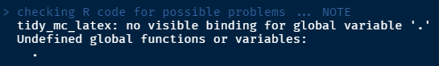

```{r setup, include=FALSE, message=FALSE, warning=FALSE}
knitr::opts_chunk$set(echo = TRUE)

library(tidyverse)
library(kableExtra)
library(tidyMC)
```

# Introduction

Monte Carlo Simulations (henceforth MCS) are used to study the properties of econometrics inference techniques by simulation. 
They are almost always part of theoretical econometric research to study the performance of some inference technique. They supplement theoretical research most often in one of four ways. Firstly, they are used to assess the performance of asymptotically valid techniques in smaller samples. Secondly, they are  used to assess how robust a technique is to violations of its theoretical assumptions. Thirdly, they allow to compare the performance of different techniques for a given data generating process (DGP). Fourthly, MCS allows to investigate the properties of inference techniques for which no analytic solution exists.  Moreover, MCS itself can be used as a statistical inference technique. For example, Bootstrap Inference can be conceptualized as a special case of MCS. Beyond these examples, there are many more areas where MCS is used. However, independent of its use-case, easy and efficient implementation of MCS is currently only sparsely available.

With our `tidyMC` package, we want to enable researchers to easily and efficiently include MCS in their work using the programming language `R` [@baser]. For one, `tidyMC` allows to easily speed up MCS by providing efficient parallelization options over a pre-specified parameter grid. Because MCS involves repeated computation, using parallel workers allows for significant reductions in computation time. For another, `tidyMC` returns an easy-to-work-with output. The output allows to access the result of all simulations for every parameter combination in the parameter grid. Moreover, `tidyMC` provides functions to effectively communicate the results of the MCS. Using the output, the simulation results can then be easily visualized using the package's plot function, which returns a `ggplot` object, that allows researchers to customize the object to their liking. Additionally, the package provides a function that converts the results into publication-ready `LaTeX` tables. The table is heavily customizable and thereby allows researchers to effectively communicate their results.

This report is structured as follows: section \ref{sec_montecarlosimulation} gives an introduction to why and how Monte Carlo simulations work and provides a simple OLS example. Section \ref{sec_vignette} presents `tidyMC`'s vignette. The vignette gives an easy-to-follow guide on how to implement MCS using the `tidyMC` package. Section \ref{sec_comparison} compares the performance of `tidyMC` to the performance of the `MonteCarlo` package and other potential MCS implementations. Section \ref{sec_packageprinciples} explains the coding practices we followed and gives a conceptual overview of how we implemented MCS in `R`. Section \ref{sec_conclusion} concludes.

# Monte Carlo Simulation
\label{sec_montecarlosimulation}
MCS allows analyzing the properties of classic econometric inference techniques. As a simulation-based technique, MCS applies a statistical procedure to many synthetically created samples. The repeated application of the procedure to a fully known DGP helps to investigate the properties of statistical techniques in a wide set of settings. It is possible to use MCS as a simulation-based inference technique itself. In this section, we want to give a brief overview of how and in which circumstances MCS work, mainly following @kiviet2012monte.


## Pseudo Random Number Generation and the Data Generating Process

Using MCS on computers has the great advantage that, with the necessary information, the simulation results can be replicated on most machines. This is possible because, given seed and algorithm, the numbers created by a random number generator are completely reproducible. MCS generally start with a synthetically created i.i.d. sample. Computers are, however, not able to generate truly random draws from different distributions. Instead, the computer draws from different distributions that are generated through pseudo-random draws from a uniform distribution. Draws from a uniform distribution are created by using so-called random number generators (RNG). These algorithms are applied to a natural number, called the seed. The resulting values are pseudo-random because they are indistinguishable from truly random numbers but are fully determined by the combination of the algorithm and the seed. The combined knowledge of the algorithm and the seed allows exact replication of a series of pseudo-random numbers generated. The purpose of the `tidyMC` package is to additionally allow easy parallelization of the MCS. With parallel computing, special attention has to be paid to creating disjoint and sufficiently long sets of draws from a uniform distribution. Our package builds on the L’Ecuyer-CMRG RNG streams implemented in `furrr::furrr_options`. The algorithm creates reproducible sets of numbers for each parallel worker, using an integer seed of at most length 7. Alternatively, a seed of length 1 is accepted, which internally is mapped to a valid seed of length 7. Because the algorithm creates a subset of random numbers for each worker, the stream and hence the MCS results are only reproducible if the same number of parallel workers is used. Moreover, our function allows the users to supply a user-generated list of random numbers. Draws from other distributions are then simulated using their CDF and the draws from the uniform distribution. Complex multivariate distributions can then be simulated as functions of different standard distributions. This allows us to generate and work with distributions that are analytically not manageable @[kiviet2012monte].


## Monte Carlo Distribution Approximation

MCS is most commonly used to infer properties of the distribution of statistics in a fixed setting, i.e. for a prespecified DGP, hence the simulation results hold only for this. Since it additionally only approximates the distribution numerically, we need to control for the resulting approximation inaccuracies. In MCS we generally simulate the distribution of a statistic $q_n$. The statistic can often be expressed as a function of a parameter vector $\beta$, some deterministic variables $D$, some random variables $v$, and a given number of observations, s.t. $q_n = q_n(\beta,D,v,n)$. What a MCS ultimately achieves is a numerical approximation of the true distribution of $q_n$ for the specified DGP. Let $q_n^R$ be the statistic generated by the $R^th$ MCS. Then the histogram of all $q_n^R$ is an unbiased and consistent estimator of $q_n$. Thus, the precision of the approximation is controlled by setting the number of Monte Carlo estimates. We can then use different statistics such as mean and variance on $q_n^R$ to summarize the distribution of the statistic for the prespecified DGP. The approach can of course be easily extended to a vector of statistics $q_n$ [@kiviet2012monte].


## Monte Carlo Best Practices


@kiviet2012monte gives a few things that need to be considered when doing and presenting MCS. The results must allow the audience to get a precise picture of the Monte Carlo experiment. MCS generally involves testing the attributes of $q_n$ not only for one DGP but for a wide set of DGPs that may include \hl{nuisance} parameters that may significantly alter the distribution.

Instead of going through every use case, we next describe one specific MCS use case. The insights from that use case should however be easily transferable to other MCS applications. One way to perform MCS is mimic analytic derivations. For example, if properties of an asymptotically consistent technique are studied, the MCS should include different nuisance parameters over increasing sample sizes. The report of the results should then include the technique's key performance indicators, such as bias and efficiency, over different combinations of nuisance parameters and sample sizes. As the parameters are the explanatory variables of the MCS [@kiviet2012monte], their values have to be chosen with care to appropriately represent the results from the experiment. The reported representative selection of sample size and nuisance parameters should then show the - potentially nonlinear - behavior of the key indicators of the performance of the technique. As the later sections will show, `tidyMC` provides easy options to define an arbitrarily large parameter grid to use for the MCS as well as user-defined performance indicators. The packages' summary functions allow the researcher to get a quick overview of the results of the combinations defined in the parameter grid. The plot and table functions allow afterwards to easily communicate the desired results. Due to the flexible design of the `tidyMC`, the parameter grid can easily be extended to include different estimators for comparisons. It also allows using the distribution of the data itself to generate a new sample, from which we can then infer the properties of an estimator [@kiviet2012monte]}.


## OLS consistency

To demonstrate how a MCS works, we provide an example using the estimation of a linear model using the ordinary least squares (OLS) estimator [@hayashi2011econometrics]. Given a dependent variable $\boldsymbol{y}$ and a set of i.i.d. regressors $\boldsymbol{X} = \{\boldsymbol{x_1}, \boldsymbol{x_2}\}$ we consider the linear DGP
\begin{equation}
	\label{eq_DGP}
	\boldsymbol{y} = \beta_0 + \beta_1 \boldsymbol{x_1} + \beta_2 \boldsymbol{x_2} + \boldsymbol{\varepsilon},
\end{equation}  
where $\boldsymbol{\beta}  = \{\beta_0, \beta_1, \beta_2\}$ are the coefficients and $\boldsymbol{\varepsilon}$ is a normally distributed error term with variance $\sigma^2$, i.e. $\varepsilon_i \sim \mathcal{N}(0,\sigma^2)$. The corresponding OLS estimators $\boldsymbol{\hat{\beta}}$ and $s^2$ for $\boldsymbol{\beta}$ and $\sigma^2$  are
\begin{align}
	\hat{\beta} = (\boldsymbol{X}'\boldsymbol{X})^{-1} \boldsymbol{X}'\boldsymbol{y},\\
	s^2 =   \frac{1}{n-k-1} \boldsymbol{\hat{\varepsilon}}' \boldsymbol{\hat{\varepsilon}},
\end{align}
where $k = 2$ is the number of regressors and $\boldsymbol{\hat{\varepsilon}}$ is the vector of residuals. Both estimators are consistent and unbiased [@hayashi2011econometrics]. Accordingly OLS should be able to correctly estimate the coefficients for every sample size, while the precision of the estimates should increase in the sample size.

\noindent Using a MCS we can demonstrate the properties of the OLS estimator. Fixing the coefficients $\boldsymbol{\beta} = \{1, 4, 5\}$ and $\sigma^2 = 3$, we generate different DGPs using different normal distributions to generate the dependent variables $\boldsymbol{x_1}$ and $\boldsymbol{x_2}$. Additionally, we generate $\boldsymbol{\varepsilon}$ from its respective distribution, and we estimate OLS on this sample. The number of observations we use is set to $\boldsymbol{n} = \{100, 200, 300\}$, which will be used to assess the convergence of the OLS estimators. We repeat the estimation 1000 times for each $n$.

The results demonstrate the performance of OLS estimation with increasing sample sizes. As expected figures \ref{fig:ols_b1}, \ref{fig:ols_b1_se} and table \ref{tab:ols_table} confirm that a bigger sample size leads to a more precise estimation of the underlying population values. Comparing both panels, we see that this behavior is just confirmed, as the estimated values do not differ and they become more precise. Moreover, the densities present show the unbiasedness of the estimator and the decrease of its standard deviation with more observations.

<!-- HUHU: I tried to fix the figure references - try if it works now -->

```{r, echo = FALSE, eval = TRUE, results = "hide", message=FALSE, fig.show='hide'}

ols_test <- 
  function(b0, b1, b2, n, sigma2, param_x1, param_x2, inc.x2){
    
    # generation of data
    x1 <- rnorm(n = n, mean = param_x1[1], sd = param_x1[2])
    x2 <- rnorm(n = n,  mean = param_x2[1], sd = param_x2[2])
    e <- rnorm(n, sd = sqrt(sigma2))
    y <- b0 + b1*x1 + b2*x2 + e
    
    if (inc.x2 == 0){
      x2 <- x2 * inc.x2
    }
    
    # application of method
    estim <- lm(y ~ x1 + x2)
    
    # evaluation of the result for a single repetition and parameter combination
    out <- list(B0 = estim$coefficients[1],
                B0_se = summary(estim)$coefficients[1,2],
                B1 = estim$coefficients[2],
                B1_se = summary(estim)$coefficients[2,2],
                B2 = estim$coefficients[3],
                sigma2 = var(estim$residuals))
    return(out)
}

param_list_ols <-
  list(n = c(100, 200, 300), inc.x2 = c(0,1))

set.seed(101)

ols <- future_mc(fun = ols_test,
                 repetitions = 1000,
                 param_list = param_list_ols,
                 b0 = 1,
                 b1 = 4,
                 b2 = 5,
                 param_x1 = c(1,2),
                 param_x2 = c(3,4),
                 sigma2 = 3)
```

```{r ols_table, echo = FALSE}

tidy_mc_latex(summary(ols),
              parameter_comb =  list(inc.x2 = 1),
              repetitions_set = c(10, 1000),
              kable_options = list(
                col.names = c("N. Observations",
                              "$x_2$ Included or not",
                              "$\\hat{\\beta}_0$",
                              "S.d. $\\hat{\\beta}_0$",
                              "$\\hat{\\beta}_1$",
                              "S.d. $\\hat{\\beta}_1$",
                              "$\\hat{\\beta}_2$",
                              "$s^2$"),
                caption = "Ommited variable bias MC results",
                escape = FALSE)) %>%
  kableExtra::kable_styling(latex_options = "HOLD_position")

```


```{r ols_b1, echo = FALSE, fig.cap="MC $\\beta_1$ results", out.width = "80%", out.height= "80%", fig.align = 'center'}
(plot(ols, plot = FALSE, parameter_comb = list(inc.x2 = 1))$B1)

```

```{r ols_b1_se, echo = FALSE, fig.cap="MC S.d. $\\beta_1$ results", out.width = "80%", out.height= "80%", fig.align = 'center'}
(plot(ols, plot = FALSE, parameter_comb = list(inc.x2 = 1))$B1_se)

```


## Omitted variable problem

Moreover, a common problem for estimation is the inclusion of suitable regressors into the model. One of these is the absence of relevant variables in the model, also called omitted variable problem. In this subsection we test the impact of this problem in OLS estimation [@hayashi2011econometrics].

We test the effects of estimating a model using only $\boldsymbol{x_1}$ when the underlying DGP follows the structure of \eqref{eq_DGP}. If $\boldsymbol{x_1}$ and $\boldsymbol{x_2}$ are correlated, the absence of one of them in the regression model will cause the available variable to be correlated with the error term, thus violating one of the main assumptions OLS. This correlation will lead to a biased estimation of $\beta_1$ (assuming $\boldsymbol{x_1}$ is contained in the model and $\boldsymbol{x_2}$ is omitted). If there is no correlation between $\boldsymbol{x_1}$ and $\boldsymbol{x_2}$ and $\boldsymbol{x_2}$ is omitted, $\boldsymbol{x_1}$ and the error term will still be uncorrelated. Thus, in that case, we expect $\hat{\beta}_1$ to still be an unbiased estimator for $\beta_1$. In any case, the exclusion of the relevant variable $\boldsymbol{x_2}$ will result in a less efficient estimation of $\beta_1$, as the estimated model tries to explain the effect of $\boldsymbol{x_2}$ by $\boldsymbol{x_1}$.

We set the structure of the estimated DGP identical to the base case, only that $\boldsymbol{x_2}$ is excluded from the estimation model. To show the loss in efficiency we present the density plots for the Monte Carlo results for $\hat{\beta}_1$ and its standard error in figures \ref{fig:ommit_b1} and \ref{fig:ommit_b1_se}. There is a clear difference in term of the variance of the estimated MC coefficients between the case where $\boldsymbol{x_2}$ is included into the model and not. In other words, the variance of $\hat{\beta}_1$ decreases much slower for increasing $n$ if $\boldsymbol{x_2}$ is not included in the model. This can also be seen for the standard deviation of $\hat{\beta}_1$: if $\boldsymbol{x_2}$ is included in the model, the standard deviation of $\hat{\beta}_1$ converges to 0 for already small sample sizes $n$. However, if $\boldsymbol{x_2}$ is not included in the model, the standard deviation of $\hat{\beta}_1$ converges much slower to 0, and thus bigger sample sizes would be needed to obtain the same degree of efficiency for $\hat{\beta}_1$. Nonetheless, we observe that the OLS estimate remains unbiased in any case, since $\boldsymbol{x_1}$ and $\boldsymbol{x_2}$ are uncorrelated.

<!-- HUHU: Rewrote the above 2 parts quite a bit, please double check. -->

```{r ommit_b1, echo = FALSE, fig.cap="MC S.d. $\\beta_1$ ommited variable problem results", out.width = "80%", out.height= "80%", fig.align = 'center'}
(plot(ols, plot = FALSE)$B1)

```

```{r ommit_b1_se, echo = FALSE, fig.cap="MC S.d. $\\beta_1$ ommited variable problem results", out.width = "80%", out.height= "80%", fig.align = 'center'}
(plot(ols, plot = FALSE)$B1_se)

```


# Vignette
\label{sec_vignette}

In the following vignette we are going to present how to obtain the results of the \@ref(OLS consistency) and \@ref(Omitted variable problem) chapters by using the `tidyMC` package.


## Package overview

Monte Carlo simulations aim to study the properties of statistical inference techniques. At its core, a Monte Carlo simulation works through the application of the techniques to repeatedly drawn samples from a pre-specified data generating process. The `tidyMC` package aims to cover and simplify the whole workflow of running a Monte Carlo simulation in either an academic or professional setting. Thus, `tidyMC` aims to provide functions for the following tasks:

* Running a Monte Carlo simulation for a user defined function over a parameter grid using `future_mc()`

* Summarizing the results by (optionally) user defined summary functions using `summary.mc()`

* Creating plots of the Monte Carlo simulation results, which can be modified by the user using `plot.mc()` and `plot.summary.mc()`

* Creating a `LaTeX` table summarizing the results of the Monte Carlo simulation using `tidy_mc_latex()`

In the following subsections we will show how you can implement those tasks using the `tidyMC` package.


## Installing tidyMC

Until now, the `tidyMC` package is not on CRAN, thus you need to download the development version from [GitHub](https://github.com/stefanlinner/tidyMC) as follows:

```{r, eval=FALSE}
# install.packages("devtools")
devtools::install_github("stefanlinner/tidyMC")
```

Afterwards you can load the package:

```{r}
library(tidyMC)
```

Moreover, the following packages will be used in this vignette:

```{r, warning=FALSE, message=FALSE}
# install.packages("magrittr")
library(magrittr)
# install.packages("ggplot2")
library(ggplot2)
# install.packages("kableExtra")
library(kableExtra)
```


## Run your first Monte Carlo simulation with `future_mc()`

`future_mc()` allows you to run a Monte Carlo simulation for a user defined function and given parameters. The first argument of `future_mc()` is `fun` which has to be a function that handles the generation of data, the application of the method of interest and the evaluation of the result for a single repetition and parameter combination. `future_mc()` handles the generation of loops over the desired parameter grids and the repetition of the Monte Carlo experiment for each of the parameter constellations. Consider the following example for `fun` and note that it performs the required tasks of generating data, applying the method and evaluating the results:

```{r}
# fun
ols_test <- 
  function(b0, b1, b2, n, sigma2, param_x1, param_x2, inc.x2){
    
    # generation of data
    x1 <- rnorm(n = n, mean = param_x1[1], sd = param_x1[2])
    x2 <- rnorm(n = n,  mean = param_x2[1], sd = param_x2[2])
    e <- rnorm(n, sd = sqrt(sigma2))
    y <- b0 + b1*x1 + b2*x2 + e
    
    if (inc.x2 == 0){
      x2 <- x2 * inc.x2
    }
    
    # application of method
    estim <- lm(y ~ x1 + x2)
    
    # evaluation of the result for a single repetition and parameter combination
    out <- list(b0 = estim$coefficients[1],
                b1 = estim$coefficients[2],
                b2 = estim$coefficients[3],
                sigma2 = var(estim$residuals))
    return(out)
  }
```

The second argument of `future_mc()` is `repetitions` which should be an integer specifying the number of Monte Carlo iterations. While the third argument `param_list` has to be a list whose components are named after the parameters of `fun` which should vary for the different Monte Carlo simulation and each component is a vector containing the desired grid values for the parameter. Consider the following example for `param_list` and note that its components are named accordingly to the parameters of `ols_test`: `n` and `inc.x2`, respectively:

```{r}
# param_list
param_list_ols <- 
  list(n = c(100, 200, 300), inc.x2 = c(0,1))
```

`future_mc()` takes care of creating all possible parameter combinations of `param_list` and runs the Monte Carlo simulation over all of these \hl{for all possible combinations}. If you don't want to run a Monte Carlo simulation for every possible parameter combination you can alternatively define `param_table` with a `data.frame` or `data.table` containing the parameter combinations you are interested in. The `...` argument can be used to specify further arguments of `fun` which are not contained in `param_list`. Those arguments will be held fixed for all parameter combinations. In our OLS example those arguments are `b0`, `b1`, `b2`, `sigma2`, `param_x1`, and `param_x2`.

Moreover, there are four formal requirements that `fun` and thus `ols_test` have to fulfill:

* The arguments of `fun` which are present in `param_list` have to be scalar values. Note that the arguments of `ols_test` which are contained in `param_list_ols`: `n` and `inc.x2` are scalar values. The remaining arguments of `ols_test` are allowed to take non-scalar values.

* Every variable used inside `fun` has either to be defined inside `fun` or given as an argument through the `...` argument.

* The value returned by `fun` has to be a named list. In our example the names of the returned list are `b0`, `b1`, `b2`, and `sigma2`.

* The names of the returned values and those of the arguments contained in `param_list` need to be different. Moreover, they cannot be `params`, `repetitions` or `setup` as these names are already occupied. Note that `b0`, `b1`, `b2`, and `sigma2` are the names of the returned values as well as names of arguments of `ols_test`. However, none of those arguments is contained in `param_list_ols`. If we would add either of those variables to `param_list_ols` we would need to change the name of the returned value for the respective variable.

We recommend to even further restrict the return value of `fun` to be a named list of scalars. This allows you to use all comfort functions of the `tidyMC` package. As you can see, we did that for `ols_test`.

The argument `parallelisation_plan` allows the user to set a parallelisation plan. While the argument `parallelisation_options` allows the user to fine tune functions, such as `furrr::future_map()` by `furrr::furrr_options()`. The argument `seed` for `furrr::furrr_options()` can be specified in `parallelisation_options` following the formal requirements of its respective documentation. Moreover, the user can also decide not to run the Monte Carlo in parallel by setting `parallel = FALSE`. To construct `parallelisation_plan` the user needs to provide a list named after the arguments of `future::plan`. The main argument `strategy` needs to provide the specific type of parallelisation the user would like to use and the number of cores which are used in the function. Some of the options for strategy are: `multisession`, `multicore` and `cluster`. We strongly recommend the user to read the documentation of the `future` package for a more detailed instruction of how to set up the different strategies.

As a default (`check = TRUE`) `future_mc()` runs a quick check by running a single test-iteration for each parameter combination in order to check for possible errors in `fun`. If a error occurs the user not only receives the error message but also the parameter combinations for which the error occurred:

```{r, error=TRUE}
set.seed(101)
first_mc_ols <- future_mc(
  fun = ols_test, 
  repetitions = 1000, 
  param_list = param_list_ols, 
  b0 = 1, 
  b1 = 4, 
  b2 = 5, 
  sigma2 = -2,
  param_x1 = c(0,5),
  param_x2 = c(0,6),
  check = TRUE
)
```

The attentive reader might already have noticed that we specified `sigma2 = -2` which doesn't make sense, as the variance of the error term cannot be negative. This results in a failed check for all parameter combinations, as this parameter is held fixed for any combination. Once we correct that mistake, we can run our first Monte Carlo simulation:

```{r}
set.seed(101)
first_mc_ols <- future_mc(
  fun = ols_test, 
  repetitions = 1000, 
  param_list = param_list_ols, 
  b0 = 1, 
  b1 = 4, 
  b2 = 5, 
  sigma2 = 2, # correctly specify sigma2
  param_x1 = c(0,5),
  param_x2 = c(0,6),
  check = TRUE
)
```

`future_mc` returns a list of type `mc` and length `r length(first_mc_ols)` consisting of a tibble (`first_mc_ols$output`) containing the return value of `fun` for each iteration and parameter combination. In our case `first_mc_ols$output` contains a column for each output `b0`, `b1`, `b2`, and `sigma2`, as well as a column for each parameter in `param_list_ols` and a column containing the `nice_names` of the parameter combinations. Overall the `first_mc_ols$output` consists of `r nrow(first_mc_ols$output)` rows, i.e., for each parameter combination 1.000 rows:

```{r}
first_mc_ols$output
```

If `ols_test` would not return a named list of scalars, but a named list of non-scalars, then `first_mc_ols$output` would not contain a column for each output, but a single column containing the named list of non-scalars for each iteration and parameter combination.

Moreover, `first_mc_ols` returns much other information about the Monte Carlo simulation that can be printed in a dense representation:

```{r}
first_mc_ols
```


## Summarize your results with `summary.mc()`

If `fun` returns a named list of scalars the user can use `summary.mc()` to summarize all Monte Carlo results. The first argument of the function is an object of class `mc` returned by `future_mc()`. The next argument `sum_funs` determines which summarizing functions will be used on the simulation results. The functions can be provided for any combination of: parameter combinations resulting from `param_list`, and the outputs of `fun`. Every specified function can only take one argument, which is the vector (with length `repetitions`) for every output. We will present all customization options of `sum_funs` in a step wise manner.

The first option of summarizing the results is given by just providing the `mc` object to `summary.mc`. In this case, `mean()` will be applied to all numeric values and `summary()` to all non-numeric data types. When the summarizing functions return one numeric value (like `mean()`) the results are twofold:

* First, a single scalar result of the function evaluated using the complete output vector is returned in the first element.

* Second, a vector with length `repetitions` of numeric results from the step wise calculation of the function's result across the output's vector. We call this resulting vector as the "path" of the summarizing function.

Additionally, to save computation time the parameter `which_path` is available to the user who wants to specify for which outputs the "path" should be calculated. The user needs to provide a character vector with the output names'. Moreover, the options `"all"` (the default) and `"none"` are also available.

For the OLS example since all outputs of `ols_test` are numeric, the returned object will be a named nested list composed of four elements named after the `nice_names` returned by `future_mc()`. Each of this elements are itself lists containing the summarized outputs, i.e. `b0`, `b1`, `b2`, and `sigma2`. Lastly each of these are composed by the "path" and scalar result of `mean()`. 

```{r}
# Default
summary_default <- summary(first_mc_ols)
summary_default
str(summary_default[[1]])
```

This nested list structure should give an idea of the reach and flexibility the `sum_funs` argument is allowed to have, since the user can specify a function for each element in this list.

For an intermediate level of customization, the user can provide a combination of summarizing functions for every output, which will be used for all parameter combination. In the case of the OLS example, if we want to apply `mean()` on all estimated coefficients, but we want to use `var()` on the MC results of `sigma2`, the `sum_funs` should have the following structure:

```{r, eval = FALSE}
# summarizing output the same way for each parameter combination with one function combination
sum_funs_ols <- list(b0 = mean, b1 = mean , b2 = mean, sigma2 = var)
```

Moreover, the user can specify any function provided it takes the output vector as only available argument.

Lastly for the last level of customization, a nested list named after the `nice_names` where every element follows the structure of the last example (components named after the outputs and each component is a function) can be specified. We present an example for this:

```{r}
quantile_sum <- function(x) quantile(x, probs = 0.75)

# summarizing output differently for different parameter combinations
sum_funs2 <-
  list(
    list(b0 = quantile_sum, b1 = min, b2 = min, sigma2 = mean),
    list(b0 = mean, b1 = quantile_sum, b2 = mean, sigma2 = mean),
    list(b0 = median, b1 = median, b2 = median, sigma2 = mean),
    list(b0 = max, b1 = max, b2 = max, sigma2 = mean),
    list(b0 = min, b1 = min, b2 = min, sigma2 = quantile_sum),
    list(b0 = mean, b1 = mean, b2 = quantile_sum, sigma2 = quantile_sum)
  )
names(sum_funs2) <- first_mc_ols$nice_names
summary_out_param_spec <- summary(first_mc_ols, sum_funs = sum_funs2)
```

We would like to reiterate that the provided summary functions are not restricted regarding the complexity of their return value. However, the path of the summarized output over all simulation repetitions is only returned if the provided summary functions return a single numeric value. Thus, the following comfort functions `plot.summary.mc()` and `tidy_mc_latex()` will only work in this specific case.


## Plot your Monte Carlo Simulation with `plot.mc()` and `plot.summary.mc()`

If `fun` returns a named list of scalars the user can use `plot.mc()` to generate a list of objects of class `gg` and `ggplot2` for all Monte Carlo results. The first argument of the function is an object of class `mc` returned by `future_mc()`. Using the argument `plot` the user can indicate whether the generated plots should be printed immediately or only returned as a list. The list will contain one plot for each output of `fun` comparing the results of the different simulation setups. In general, `plot.mc()` generates density plots for numeric outputs and bar plots for non-numeric outputs. In our example a plot for `b0`, `b1`, `b2`, and `sigma2` will be returned in a list of length four and as `b0`, `b1`, `b2`, and `sigma2` are all numeric outputs `plot.mc()` will return density plots for each of those:

```{r}
mc_ols_plot <- plot(first_mc_ols, plot = FALSE)
names(mc_ols_plot)
```

As the single list elements are of class `gg` and `ggplot2`, we can easily customize and extend the single plots using familiar `ggplot2` commands: 

```{r}
mc_ols_plot$b1 + 
  ggplot2::geom_vline(xintercept = 4, col = "red") + 
  ggplot2::theme_minimal()
```

When creating the plots the user can also subset the setups which he/she would like to see in the plots using the `first_mc_ols$nice_names` in the function argument `which_setup`, or a named list in `parameter_comb`. The single components of the list have to be named after the parameters specified in `param_list` and contain vectors specifying the values of the parameters to filter by. In the ols example we can filter by the parameters `n` and `inc.x2`:

```{r}
# subsetting by nice_names
mc_ols_plot_subset1 <- 
  plot(first_mc_ols, plot = FALSE, which_setup = first_mc_ols$nice_names[4:6])
#subsetting by parameter values
mc_ols_plot_subset2 <- 
  plot(first_mc_ols, plot = FALSE, parameter_comb = list(inc.x2 = 1))

mc_ols_plot_subset1$sigma2
```

Thus, if the user wants distinct plots for every parameter combination, one needs to subset the plot for any single setup in `first_mc_ols$nice_names`.

Finally, you can also plot the simulation results for several parameter combination in one single plot by specifying the argument `join` with the respective `first_mc_ols$nice_names`:

```{r}
mc_ols_plot_joint <- plot(first_mc_ols, plot = FALSE, join = first_mc_ols$nice_names)
mc_ols_plot_joint$b2
```

Please be aware that the only one of the three arguments `which_setup`, `parameter_comb`, and `join` can be specified at the same time.


If the provided summary functions in `summary.mc()` return a single numeric value and thus a path of the summarized output over all simulation repetitions is returned, the user can use `plot.summary.mc()` to plot those paths. The first argument of the function is an object of class `summary.mc` returned by `summary.mc()`. Just as `plot.mc()`, `plot.summary.mc()` returns a list of objects of class `gg` and `ggplot2`. The list will contain one line plot for each output of `fun` displaying the paths of the results of the different simulation setups. The arguments `plot`, `which_setup`, `parameter_comb`, and `join` can be specified the same way as for `plot.mc`: 

```{r}
sum_mc_plot <- plot(summary_default, plot = FALSE)
sum_mc_plot$b1 + 
  ggplot2::geom_vline(xintercept = 100, col = "red") +
  ggplot2::theme(axis.text.x = element_text(angle = 45, hjust = 0.1, vjust = 0.2))

sum_mc_plot_subset1 <- 
  plot(summary_default, plot = FALSE, which_setup = first_mc_ols$nice_names[4:6])

sum_mc_plot_subset2 <- 
  plot(summary_default, plot = FALSE, parameter_comb = list(inc.x2 = 1))

sum_mc_plot_subset2$b1

sum_mc_plot_joint <- 
  plot(summary_default, plot = FALSE, join = first_mc_ols$nice_names[4:6])

sum_mc_plot_joint$b1
```


## Create a LaTeX table of your results with `tidy_mc_latex()`

Using `tidy_mc_latex` the user can present the results from `future_mc` directly into a `LaTeX` document using all the benefits from the `kableExtra` package. The first and main argument `x` needed by `tidy_mc_latex` is a `summary.mc` object obtained from `summary.mc()`. To present the results in a comprehensive manner the function requires that all summarized outputs in `summary.mc` be scalar numeric results for all parameter combinations. In case, the summarizing function returns more than one argument then this will be presented in the table as an `NA` value. The second argument of the function is `repetitions_set` which allows the user to see the certain values of the "path" of the summarized results of `fun`. To illustrate this we use the MC results for the OLS example:


```{r}
tidy_mc_latex(
  x = summary(first_mc_ols),
  repetitions_set = c(10, 1000)
) %>%
  kableExtra::kable_styling(latex_options = "HOLD_position")
```

The resulting table is composed of two panels, which corresponds to the length of `repetitions_set`. In them the columns correspond to the results of the summarizing functions for `b0`, `b1`, `b2`, and `sigma2`, and the rows correspond to specific combinations of the parameters provided in `parameter_list`. The footnote in the table shows the number of repetitions and the total parameter combinations provided to `future_mc`.

Moreover, the next three arguments in `tidy_mc_latex` are comfort options to select which results of `summary.mc` depending on the parameter combinations will be presented in the table. On one hand, The argument `which_setup` allows the user to make use of the `nice_names` of the parameter combinations in the returned object by `future_mc()` to subset the rows in the table. On the other hand, the argument `parameter_comb` is used to directly filter the parameters by their values. This argument requires a named list, containing vector or scalar values of all parameters to be filtered from. The user must only provide one of this arguments at a time. We show how to make use of both parameters to subset the rows of table for $n = 100$ and $inc_{x2}=1$:

```{r}
tidy_mc_latex(
  x = summary(first_mc_ols),
  repetitions_set = c(10, 1000),
  which_setup = first_mc_ols$nice_names[1]) %>%
  kableExtra::kable_styling(latex_options = "HOLD_position")

tidy_mc_latex(
  x = summary(first_mc_ols),
  repetitions_set = c(10, 1000),
  parameter_comb = list(n = 100, inc.x2 = 1)) %>%
  kableExtra::kable_styling(latex_options = "HOLD_position")
```

The user can also subset the outputs of the original function (columns in the table) using the parameter `which_out`. This is done using a character vector with the names of the outputs, e.g. to only show the columns for `b0` and `sigma2` the user needs to set `which_out = c("b0", "sigma2")`.

Lastly, by providing a named list to the argument `kable_options`, the user can change all arguments of the underlying function `kable::kbl()`. The names of the list have to be equal to the names of the arguments of the function and the contents of every element also has to fulfill its requirements. We provide an example of how this list should be constructed, but for optimal usage we strongly recommend the user to see the documentation of the `kable::kbl()` function.

To allow for further customization the returned object by `tidy_mc_latex` is of class `knitr_kable`, therefore the user can utilize most functions from the `kableExtra` package in the standard `tidyverse` manner. For example:

```{r}
tidy_mc_latex(summary(first_mc_ols), 
              repetitions_set = c(10, 1000),
              kable_options = list(
                col.names = c("Number of observations",
                              "$x_2$ included or not",
                              "$\\beta_0$", "$\\beta_1$",
                              "$\\beta_2$", "$s^2$"), 
                caption = "Ommited variable problem MC results",
                escape = FALSE
              )
) %>%
  kableExtra::kable_styling(latex_options = "HOLD_position")
```


# Comparison to other Monte Carlo Approaches in R
\label{sec_comparison}

## Design of the functions

We conceptualization our an MCS implementation to be flexible enough to allows for all potential MCS use cases, while framing the functions into the `tidyverse` structure [@wickham2017tidyverse]. Previously, the `MonteCarlo` package [@montecarlopackage] already provides a convenient framework for the paralellised implementation of MCS, to which we compare the structure of our package. To run the MCS, `tidyMC` provides the `future_MC` function, while a MCS in the `MonteCarlo` is run  using the function with the packages name. 

Both our `future_mc` and the `MonteCarlo` functions can be diveded into two parts. Firstly, we have the preamble of the function. The preamble includes the set-up of the arguments, data containers, and error checking as parts of each function. Secondly, we have the actual simulation of the MC study over a user-specified parameter grid. Our `tidyMC` package and the `MonteCarlo` packages differ in regard to both parts.

On one hand, the whole development of our package builds on the benefits of the `tidyverse` functions in contrast to the base `R` implementation of `MonteCarlo`. For example, the creation of parameter grids, the structure of the data, and the repeated calculations, rely heavily in functions provided by the `stringr` [@stringrpackage], `tibble` and `purrr` [@purrrpackage] packages respectively. Most importantly, all repeated calculations that normally are handled by `for` loops we implement with their `purrr` functions. We use the input specific `purrr` functions in every implementation to reduce computation time, i.e. the mapping functions are tailored for dealing with specific data types. In contrast, the `MonteCarlo` function is built within a base `R` framework. Moreover, to offer flexibility to the user, the function uses a high number of strings for the creation of `for` loops, containers and parameter grids which are then parsed and evaluated inside the function.

On the other hand, both functions also differ in their implementation of the parallelised simulations. `future_mc` draws its computing power from the `future` package [@futurepackage] through the `furrr` package API [@furrrpackage]. The `future` package conceptualizes parallel computation based on task processing constructs called `futures`. Such `futures` are resolved in background processes while the main session continues to run. The benefit of this is twofold. For one, all tasks are centralized in a queue and are supplied to the workers as soon as they are available which keeps calculation times consistent across workers. For another, the main session can still delegate tasks and perform operations, provided that no results are required from the unresolved futures. In the design of `future_mc` we reap these benefits through the use of the `furrr::pmap()` function, to which we provide the user's function and his/her desired parameter grid replicated as many times as the user-specified number of Monte Carlo repetitions. In contrast, the `MonteCarlo` function is built around the implementation of the `snow` [@snowpackage] and `snowfall` [@snowfallpackage] packages. These packages let the user perform calculations by a master/worker scheme, this means that the main function call distributes tasks to the "workers" (CPUs). Thus, all workers resolve the tasks they are given and convey their results to the main `R` session giving the instructions.

## Speed comparison
To test the performance of `tidyMC` we evaluated the function:

```{r, echo=TRUE, eval=FALSE}
 test_func <- function(param = 0.1, n = 100, x1 = 1, x2 = 2){
   
   data <- rnorm(n, mean = param) + x1 + x2
   stat <- mean(data)
   stat_2 <- var(data)
   
    return(list(mean = stat, var = stat_2))
}
```  

To benchmark the performance of the `tidyMc`package against competing implementations using the benchmark package [@bench]. In the function we simulate the mean and the variance of a simple, randomly generate distribution. To compare the performances we tested all Monte Carlo implementations using different setups. We compute the Monte Carlos simulations using either one,four, or eight cores and either one, ten, or 100 parameter combinations. For each of these setups, we compare the speed and required memory for 100, 1000, and 10000 Monte Carlo repetitions. All comparisons were run on a 2021 Macbook Pro with the M1 processor and 8 Gb of Ram and on a laptop running Windows with 32 Gb of Ram and an intel core i7 processor of 8th generation.

```{r, eval=TRUE, echo=FALSE, fig.cap="\\label{MC_vs_tidyMC}Comparison of the `tidyMC` and the `MonteCarlo` package", fig.subcap=c('Speed Comparison', 'Memory Allocation Compations'), out.width='.49\\linewidth'}}
#load("report/speed_result.RData")

ggplot(comparison_results_mc, aes(x = reps, y = median)) +
  geom_line(aes(col = alg)) +
  facet_grid(cols = vars(n_params),
             rows = vars(cores))  +
  scale_x_continuous(trans = "log10") +
  labs(y = "Seconds",
       x = "Number of Repetitions") +
  theme(legend.position = "bottom",
        legend.title = element_blank())

ggplot(comparison_results_mc, aes(x = reps, y = mem_alloc)) +
  geom_line(aes(col = alg)) +
  facet_grid(cols = vars(n_params),
             rows = vars(cores))  +
  scale_x_continuous(trans = "log10") +
  labs(y = "Memory",
       x = "Number of Repetitions") +
  theme(legend.position = "bottom",
        legend.title = element_blank())
```


Our first comparison is between the `MonteCarlo`package and the `tidyMC`package. Figure \ref{MC_vs_tidyMC}(a) shows the median simulation speed over the different setups, while Figure \ref{MC_vs_tidyMC}(b) shows the median memory use. In both figures, we see that when using multiple cores, `tidyMC` outperforms `Monte Carlo` in terms of speed and memory. The figure also shows that `MonteCarlo`is quicker, when only one core is used. However `tidyMC` is much more memory efficient, especially with large studies that either use many repetitions or that use many parameters.  What stands out is that especially `MonteCarlo`gets slower when more cores are used. This is likely because setting up the parallelization takes a lot of time, especially with more cores. Using a more demanding function would likely have led to a different outcome. Out computers were however not able to handle more demand computations with the `bench` package. The results highlight nonetheless that using parallelization with the `furrr` approach appears to be much more efficient than with the `snow` approach. The results hence indicate that the `tidyMC` parallelization implementation is more efficient than in the `MonteCarlo` package.

```{r, eval=TRUE, echo=FALSE, fig.cap="\\label{martin_vs_tidyMC}Comparison of different parralelization approaches", fig.subcap=c('Speed Comparison', 'Memory Allocation Compations'), out.width='.49\\linewidth'}}
#load("report/speed_result1.RData")

ggplot(comparison_results_diff_approach, aes(x = reps, y = median)) +
  geom_line(aes(col = alg)) +
  facet_grid(cols = vars(n_params),
             rows = vars(cores))  +
  scale_x_continuous(trans = "log10") +
  labs(y = "Seconds",
       x = "Number of Repetitions") +
  theme(legend.position = "bottom",
        legend.title = element_blank())

ggplot(comparison_results_diff_approach, aes(x = reps, y = mem_alloc)) +
  geom_line(aes(col = alg)) +
  facet_grid(cols = vars(n_params),
             rows = vars(cores))  +
  scale_x_continuous(trans = "log10") +
  labs(y = "Memory",
       x = "Number of Repetitions") +
  theme(legend.position = "bottom",
        legend.title = element_blank())
```

Our second comparison is between the parallelization over parameters, the parallelization over repetitions, and the `tidyMC` parallelization over everything. For the comparison, we have only used the very core function of our package, without any pretests and other utility functions. Figure \ref{martin_vs_tidyMC}(a) shows the median simulation speed over the different setups, while Figure \ref{martin_vs_tidyMC}(b) shows the median memory use. The blue line shows the results from `tidyMC`, the red line the results from parallelization over the parameters, and the green line the results from parallelizing over repetitions. The plots show that in terms of speed our approach of parallelizing over all combinations is superior in all settings. However, in terms of memory usage, tidy MC generally performs worse than the other two. In contrast, parallelizing over repetitions is generally the most memory efficient. 

Overall is `tidyMC` the fastest approach if parralelization is used. When only one core is used `MonteCarlo` is marginally faster. In terms of memory parallelization over the parameters is generally the most memory efficient, whereas `MonteCarlo` requires much more memory.

# Package Principles in `tidyMC`
\label{sec_packageprinciples}

In developing the `tidyMC` package, we follow the principle of "fail early and often", i.e. if a function is misspecified, we want our function to fail as early as possible and also return readable and informative error messages. To achieve this goal, the first part of each function in our package consists of assertions to the input parameters, as these are specified by the user and are therefore error-prone. After making sure that the input parameters are correctly specified, the following core of the function should work without problems and can thus be executed. In our package, we ensure the class and general structure of the input parameters by using the `checkmate` package [@checkmatepackage]. The functions of these packages have different benefits: they can almost always be written in a readable line of code, they produce readable error messages and they are written in C, hence so we do not have to worry about execution time overhead.

Since one of our main focuses is to embed our functions in `tidyMC` into the `tidyverse` structure, we have used functions from packages of the `tidyverse` whenever possible. This is particularly evident in the following three cases: First, we use `stringr::str_c()` instead of `paste()` as this is generally faster and more stable. Second, we mostly work with `tibbles` instead of `data.frames`, as they provide more consistent subsetting behavior and we take advantage of `tibbles'` higher flexibility by storing lists in columns. Thirdly, for all repeated calculations that are normally handled by `for` loops, we implement their `purrr` counterparts. These are all implemented taking into account the type of the object being handled to reduce computation time.

To work collaboratively on our package code, we use the version control system `Git` and manage our `Git` project with `GitHub`. This ensures that our pieces of code are merged correctly and nothing gets lost along the way. It also allows us to track our development over time and easily revert to older versions of our package. We also relied heavily on [Hadley Wickham's book] [@wickham2015r], which is a great summary of best practices in package programming. As recommended by @wickham2015r, when we want to use functions from another package, we add the appropriate package to the `NAMESPACE` file by `usethis::use_package("pkg_name")` and then use the form `package::function()` when calling a function from another package in our code. This way, all dependencies are clear to the reader. To reduce package dependencies outside the `tidyverse`, we tried to avoid using packages that are not part of the `tidyverse` whenever possible.

Our typical development workflow (inspired by Hadley Wickham) looks as follows: 

* We implement the desired feature in our code relying on `tidyverse` functions

* We run an example to check whether the functionality is implemented correctly

* We use `devtools::load_all` to make our (updated) function available for experimentation

* We try to take care of the function documentation using `roxygen2` \parencite{roxygen2package} right away, as at this point all requirements for the function and the functionality are best in our mind

* We run `devtools::check` and fix all occurring notes, warnings, and errors

* A group member who was not involved in the coding runs several examples using the function to test its functionality
  
  - Whenever a bug occurs, it is reported to the developer of the function, who takes care of fixing the bug
  
  - The bug is converted into a failing test (using `testthat` [@testthatpackage] and the developer's task is to make this test pass. This test ensures that the same bug will not occur a second time.

## Unresolved Issues 
Overall `tidyMC` is a apckage that we believe simplifies running MCS. However two problems we have not yet solved fully satisfactory.

For one, with the help of various online resources, especially [Stackoverflow](https://stackoverflow.com/), we were able to fix all errors, warnings and notes returned by `devtools::check()` in a satisfactory way (for us), except for one:



If this note occurs in the context of a `dplyr` function, the problem can easily be solved by using the `rlang::.data` pronoun after adding `rlang .data` to the `@importFrom` tag in your `roxygen2` header, as explained e.g. in this [post](https://community.rstudio.com/t/how-to-solve-no-visible-binding-for-global-variable-note/28887/2?u=shamindras). However, if this note does not occur in the context of a `dplyr` function, but as in our case with `purrr::map()`, there is (at least to our knowledge) no such nice solution, as also this [stackoverflow post](https://stackoverflow.com/questions/66816638/no-visible-binding-for-global-variable) is not answered. Thus, we decided to use the second option presented in the [R-blogger post](https://www.r-bloggers.com/2019/08/no-visible-binding-for-global-variable/) and set 

```{r}
. <- NULL
```

at the respective part in the code. This solution is often used when working with the `data.table` package and deals with the note in the RCMD-check as the variable `.` then has a visible binding (to `NULL`). However, it feels a bit "hacky" to us and we would like to know if there is another more natural solution to that problem.

For another, we have not fully optimized the performance of the package in terms of speed and memory allocation. Firstly, as the speed comparisons between the `tidyMC` and `MonteCarlo` shows, the performance of `tidyMC` using only one core is not fully satisfactory. While we have tried some performance enhancements, we have not discovered a fully satisfactory soultion. For parralelized MCS, the main focus of the package, we are however satisfied with the speed results. Secondly, as the memory allocation comparison between `tidyMC` and other parallelisation approaches shows, `tidyMC` maybe optimized in the way is uses the computers memory. While we decided to optimize the speed of the MCS, there maybe use cases where memory usage is more important. In future developments, memory allocations maybe something that should be optimized as well. 

# Conclusion
\label{sec_conclusion}

With the `tidyMC` package we provide researchers with an easy and comfortable way to perform their own Monte Carlo studies. We provide a general setup, that easily allows for Monte Carlo Studies in all possible flavors. In this report, we used OLS to demonstrate how `tidyMC` may be used to efficiently set up Monte Carlo simulations over a parameter grid with parallelization. Building on the `tidyverse`, the `tidyMC` package uses the powerful `furrr` package to efficiently parallelize the Monte Carlo study over an arbitrarily complex parameter grid. We compared the `tidyMC` approach to `R`'s currently most popular package for Monte Carlos Simulations, the `MonteCarlo`package, as well as two alternative approaches. We find that `tidyMC` generally outperforms the alternatives in terms of speed and memory required. Especially with larger Monte Carlo studies using more parallel workers, our implementation is much quicker and much less memory intensive. To ease getting a quick overview of the simulation results we provide a comprehensive summary function. Lastly, to allow easy communication of the Monte Carlo results, we provide a build in plot function and a function to generate `LaTeX` tables. Both functions are highly customizable, allowing the user to tailor the output to his needs. Because our package is built largely on top of other `tidyverse` packages, it integrates very nicely into the package collection.  However, its easy usage should benefit all types of `R` users.

While we have implemented many different options for the user, there is still room for extensions. Right now the plot function only allows for plotting densities. In a future version, we may add further plotting options. Furthermore, it may be beneficial to add predesigned options for different kinds of flavors of Monte Carlo simulations. Our current implementation is as general as possible. Specifying the plot and table functions for specific use cases would likely lead to a more comfortable user experience. For example, if different estimators are compared, it might make sense to add preset plot functions that more effectively allows visualizing the differences in performance. However, given the level of generality for which we designed that package, we believe that its current implementation may nonetheless lead to good results for all potential users.

\newpage


# References
